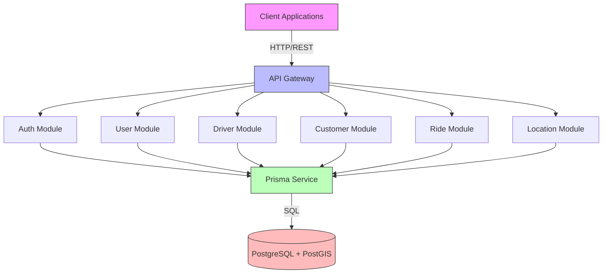
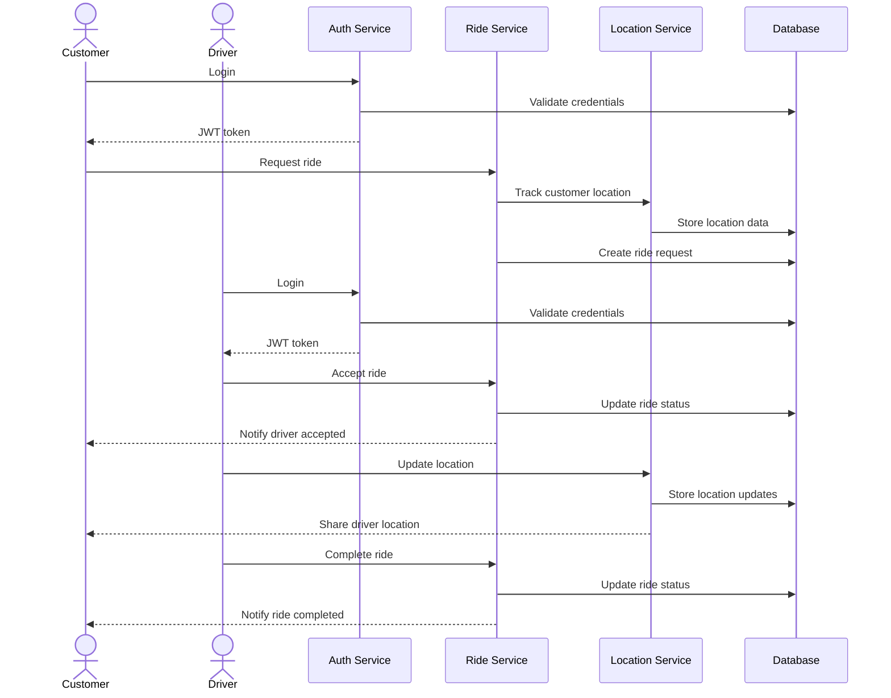

# Architecture for Ride-Sharing Backend

## Technical Summary

This architecture defines a scalable, secure backend system for a ride-sharing application built with NestJS. The system follows a modular design pattern with clear separation of concerns, using PostgreSQL with Prisma ORM for data persistence. It includes authentication, authorization, logging, and API documentation capabilities. The system is designed to handle user management, driver-customer interactions, ride scheduling, and location tracking.

## Technology Table

| Technology | Description                                                                   |
| ---------- | ----------------------------------------------------------------------------- |
| NestJS     | Progressive Node.js framework for building efficient server-side applications |
| TypeScript | Strongly typed programming language for application development               |
| PostgreSQL | Relational database for data persistence                                      |
| PostGIS    | Spatial database extension for geographic data processing                     |
| Prisma     | Next-generation ORM for database access and management                        |
| JWT        | Token-based authentication mechanism                                          |
| Passport   | Authentication middleware for Node.js                                         |
| Swagger    | API documentation and testing                                                 |
| Zod        | TypeScript-first schema validation                                            |
| Pino       | Ultra-fast Node.js logger                                                     |
| Docker     | Containerization platform (implied from structure)                            |
| Jest       | Testing framework for unit and integration tests                              |

## Architecture Diagrams





## Project Structure

```
/
├── prisma/                  # Database schema and migrations
│   ├── schema.prisma        # Prisma schema definition
│   ├── migrations/          # Database migrations
│   └── seed.ts              # Seed data for development
├── src/
│   ├── common/              # Shared utilities and helpers
│   │   └── interceptors/    # Global interceptors
│   ├── prisma/              # Prisma service and utilities
│   ├── modules/             # Application modules
│   │   ├── app.module.ts    # Root application module
│   │   ├── auth/            # Authentication module
│   │   ├── user/            # User management module
│   │   ├── driver/          # Driver-specific functionality
│   │   ├── customer/        # Customer-specific functionality
│   │   ├── ride/            # Ride management module
│   │   └── location/        # Location tracking and management
│   └── main.ts              # Application entry point
├── test/                    # Test files
├── dist/                    # Compiled output
└── node_modules/            # Dependencies
```

Each module follows NestJS's recommended structure:

- Controllers: Handle HTTP requests and define API endpoints
- Services: Implement business logic
- DTOs: Define data transfer objects for validation
- Entities: Map to database models
- Repositories (via Prisma): Handle data access
