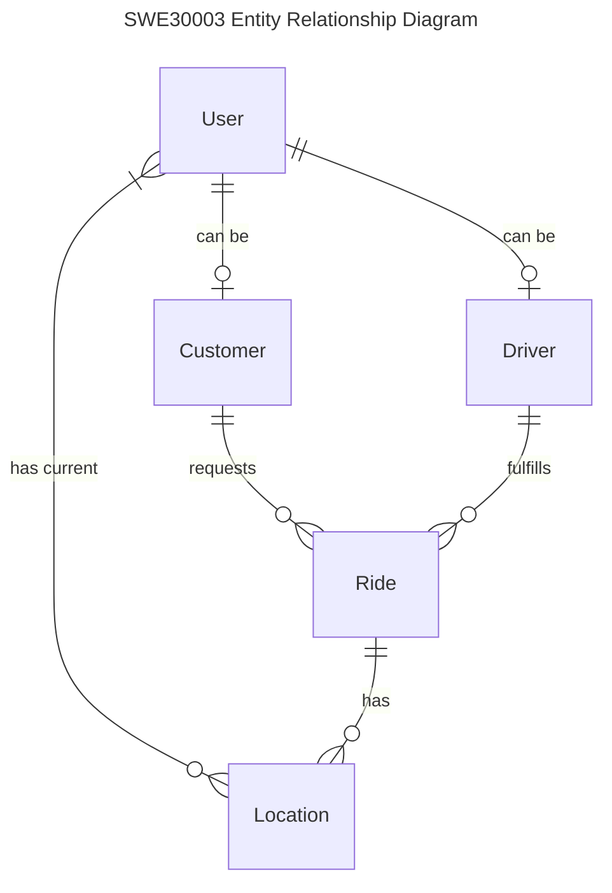

# SWE30003 Data Models

## Overview

This document outlines the core data models used in the SWE30003 application, which provides ride-sharing functionalities. The data model consists of Users, Drivers, Customers, Rides, and Locations, enabling the management of ride requests, user profiles, and location tracking.

## Entity Relationship Diagram



## Data Models

### Model: User

Core user entity that represents any user in the system.

| Field             | Type     | Required | Description                   | Constraints                       |
| :---------------- | :------- | :------- | :---------------------------- | :-------------------------------- |
| id                | String   | Yes      | Unique identifier             | Primary Key, CUID                 |
| email             | String   | Yes      | User email address            | Unique                            |
| normalizedEmail   | String   | Yes      | Normalized email for lookups  | Unique                            |
| password          | String   | Yes      | Hashed password               | Secured                           |
| address           | String   | No       | User's address                |                                   |
| firstName         | String   | No       | User's first name             |                                   |
| lastName          | String   | No       | User's last name              |                                   |
| phone             | String   | No       | User's phone number           |                                   |
| profileImg        | String   | No       | URL to user's profile image   |                                   |
| refreshToken      | String   | No       | JWT refresh token             |                                   |
| createdAt         | DateTime | Yes      | Creation timestamp            | Auto-generated                    |
| updatedAt         | DateTime | Yes      | Last update timestamp         | Auto-updated                      |
| role              | UserRole | Yes      | User role in the system       | Enum: DEVELOPER, CUSTOMER, DRIVER |
| currentLocationId | String   | No       | Reference to current location | Foreign Key                       |

### Model: Driver

Represents a driver in the ride-sharing system.

| Field     | Type     | Required | Description              | Constraints         |
| :-------- | :------- | :------- | :----------------------- | :------------------ |
| id        | String   | Yes      | Unique identifier        | Primary Key, CUID   |
| userId    | String   | Yes      | Reference to User entity | Foreign Key, Unique |
| createdAt | DateTime | Yes      | Creation timestamp       | Auto-generated      |
| updatedAt | DateTime | Yes      | Last update timestamp    | Auto-updated        |

### Model: Customer

Represents a customer who can request rides.

| Field     | Type     | Required | Description              | Constraints         |
| :-------- | :------- | :------- | :----------------------- | :------------------ |
| id        | String   | Yes      | Unique identifier        | Primary Key, CUID   |
| userId    | String   | Yes      | Reference to User entity | Foreign Key, Unique |
| createdAt | DateTime | Yes      | Creation timestamp       | Auto-generated      |
| updatedAt | DateTime | Yes      | Last update timestamp    | Auto-updated        |

### Model: Ride

Represents a ride request in the system.

| Field       | Type        | Required | Description                  | Constraints                                   |
| :---------- | :---------- | :------- | :--------------------------- | :-------------------------------------------- |
| id          | String      | Yes      | Unique identifier            | Primary Key, CUID                             |
| customerId  | String      | Yes      | Reference to Customer entity | Foreign Key                                   |
| driverId    | String      | Yes      | Reference to Driver entity   | Foreign Key                                   |
| vehicleType | VehicleType | Yes      | Type of vehicle for the ride | Enum: BIKE, CAR, LUXURY                       |
| price       | Float       | Yes      | Price of the ride            |                                               |
| status      | RideStatus  | Yes      | Current status of the ride   | Enum: PENDING, ACCEPTED, COMPLETED, CANCELLED |
| createdAt   | DateTime    | Yes      | Creation timestamp           | Auto-generated                                |
| updatedAt   | DateTime    | Yes      | Last update timestamp        | Auto-updated                                  |

### Model: Location

Represents a geographical location in the system.

| Field       | Type            | Required | Description                  | Constraints       |
| :---------- | :-------------- | :------- | :--------------------------- | :---------------- |
| id          | String          | Yes      | Unique identifier            | Primary Key, CUID |
| name        | String          | Yes      | Location name or description |                   |
| coordinates | Point Geography | Yes      | Geo coordinates (lon, lat)   | PostGIS Point     |
| rideId      | String          | No       | Reference to Ride entity     | Foreign Key       |
| createdAt   | DateTime        | Yes      | Creation timestamp           | Auto-generated    |
| updatedAt   | DateTime        | Yes      | Last update timestamp        | Auto-updated      |

### Enum: UserRole

| Value     | Description                        |
| :-------- | :--------------------------------- |
| DEVELOPER | System developer or administrator  |
| CUSTOMER  | User who can request rides         |
| DRIVER    | User who can fulfill ride requests |

### Enum: RideStatus

| Value     | Description                              |
| :-------- | :--------------------------------------- |
| PENDING   | Ride has been requested but not accepted |
| ACCEPTED  | Ride has been accepted by a driver       |
| COMPLETED | Ride has been completed successfully     |
| CANCELLED | Ride has been cancelled                  |

### Enum: VehicleType

| Value  | Description               |
| :----- | :------------------------ |
| BIKE   | Motorcycle or scooter     |
| CAR    | Standard car              |
| LUXURY | Premium or luxury vehicle |

## Relationships

| Relationship    | Type        | Description                                          |
| :-------------- | :---------- | :--------------------------------------------------- |
| User → Driver   | One-to-One  | A user can be registered as a driver                 |
| User → Customer | One-to-One  | A user can be registered as a customer               |
| User → Location | Many-to-One | A user can have a current location                   |
| Customer → Ride | One-to-Many | A customer can have multiple rides                   |
| Driver → Ride   | One-to-Many | A driver can fulfill multiple rides                  |
| Ride → Location | One-to-Many | A ride can have multiple locations (pickup, dropoff) |

## Indexes

| Model | Fields          | Type      | Description                                  |
| :---- | :-------------- | :-------- | :------------------------------------------- |
| User  | id, email       | Composite | Improved lookup performance for user queries |
| User  | email           | Unique    | Enforce unique email addresses               |
| User  | normalizedEmail | Unique    | Case-insensitive email lookups               |

## Constraints and Validations

| Model    | Constraint               | Description                                                                |
| :------- | :----------------------- | :------------------------------------------------------------------------- |
| User     | Unique email             | Ensures each user has a unique email address                               |
| Driver   | One driver per user      | A user can only have one driver profile                                    |
| Customer | One customer per user    | A user can only have one customer profile                                  |
| Ride     | Valid status transitions | Rides must follow valid status transitions: PENDING → ACCEPTED → COMPLETED |
| Location | Valid coordinates        | Must have valid latitude and longitude values                              |

## Example Usage

### Creating a New User

```typescript
// Create a new user
const user = await prisma.user.create({
  data: {
    email: 'user@example.com',
    normalizedEmail: 'user@example.com',
    password: hashedPassword,
    firstName: 'John',
    lastName: 'Doe',
    phone: '+84123456789',
    role: 'CUSTOMER',
  },
});

// Create a customer profile for the user
const customer = await prisma.customer.create({
  data: {
    userId: user.id,
  },
});
```

### Creating a Ride

```typescript
// Create a new ride
const ride = await prisma.ride.create({
  data: {
    customerId: customerId,
    driverId: driverId,
    price: 50000,
    vehicleType: 'CAR',
    status: 'PENDING',
    locations: {
      create: [
        {
          name: 'Pickup Location',
          coordinates: Prisma.raw(
            `ST_SetSRID(ST_MakePoint(${pickupLng}, ${pickupLat}), 4326)`,
          ),
        },
        {
          name: 'Dropoff Location',
          coordinates: Prisma.raw(
            `ST_SetSRID(ST_MakePoint(${dropoffLng}, ${dropoffLat}), 4326)`,
          ),
        },
      ],
    },
  },
});
```

### Updating Ride Status

```typescript
// Update ride status to ACCEPTED
const updatedRide = await prisma.ride.update({
  where: {
    id: rideId,
  },
  data: {
    status: 'ACCEPTED',
  },
});
```

### Querying Nearby Drivers

```typescript
// Find drivers near a location
const nearbyDrivers = await prisma.$queryRaw`
  SELECT 
    "User".id, 
    "User"."firstName", 
    "User"."lastName",
    ST_Distance(
      "Location".coordinates, 
      ST_SetSRID(ST_MakePoint(${longitude}, ${latitude}), 4326)
    ) as distance
  FROM "User"
  JOIN "Driver" ON "User".id = "Driver"."userId"
  JOIN "Location" ON "User"."currentLocationId" = "Location".id
  WHERE "User".role = 'DRIVER'
  AND ST_DWithin(
    "Location".coordinates, 
    ST_SetSRID(ST_MakePoint(${longitude}, ${latitude}), 4326),
    ${radiusInMeters}
  )
  ORDER BY distance
  LIMIT 10
`;
```
